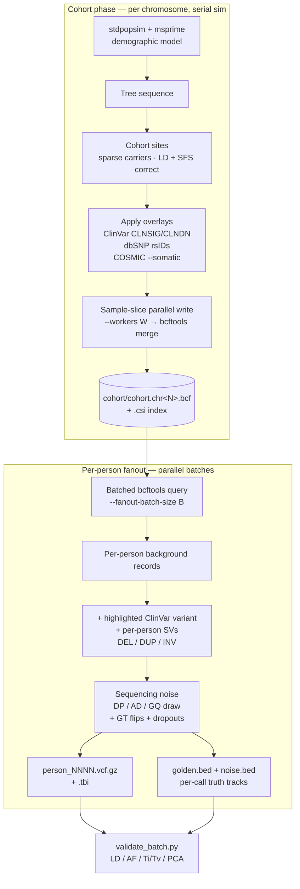

# synthetic-people

**Generate realistic synthetic whole-genome VCFs — at any cohort size,
under a published demographic model, with truth sets baked in — for
methods research, variant-caller benchmarking, teaching, and any
analysis where the cohort you need is bigger, more diverse, or more
controlled than the one you have access to.**

The headline tool, `synthetic_people/generate_people.py`, drives
[`msprime`](https://tskit.dev/msprime/) under
[`stdpopsim`](https://popsim-consortium.github.io/stdpopsim-docs/)'s
`HomSap` demographic catalogue (default `OutOfAfrica_3G09`,
[Gutenkunst et al. 2009](https://doi.org/10.1371/journal.pgen.1000695);
admixed UK-cohort pulse via [`demes`](https://popsim-consortium.github.io/demes-spec-docs/)),
grounds the resulting cohort sites against ClinVar / dbSNP / COSMIC at
real chromosome coordinates, layers in structural variants and a
tunable sequencing-noise model, and emits one VCF per person plus
per-person BED4 truth tracks listing every variant the model placed and
every noise event it injected.

---

## Who this is for

- **Variant-caller and pipeline developers** who need a per-call truth set to grade against — every flip and dropout the noise model injects lands in `noise.bed`; every ClinVar / SV / rsID injected lands in `golden.bed`. Realised FDR is reported in `manifest.json` so the requested vs. observed error rate is directly checkable.
- **Statistical-genetics methods researchers** prototyping new analyses (LD-aware fine-mapping, ancestry inference, SV-aware imputation, PRS calibration) on cohorts whose composition you can dial in. The published demography means realised LD decay, SFS shape, and ancestry proportions track theoretical expectations rather than the artefacts of a particular real cohort.
- **Clinical-variant pipeline builders** who want ClinVar-grounded VCFs that exercise `CLNSIG` / `CLNDN` handling — and ClinVar-coordinate accuracy — without needing controlled-access patient data on the test bench.
- **Instructors** preparing reproducible teaching material for population genetics, coalescent theory, or VCF handling. Same `--seed` gives every student byte-identical files; cohort sizes can be tuned to whatever fits the lab session.
- **Methods papers and supplementary code** that needs to be runnable by reviewers and readers without a DUA-gated data dependency.

Outputs are *statistically plausible* human data, not real human data.
They are designed to be appropriate for methods development and
benchmarking; they are **not** appropriate for downstream analyses that
need real allele-frequency-by-population estimates, real pedigree
structure, or any conclusion that depends on the data being a sample of
actual humans.

---

## What "realistic" means here

| Statistical property | How it's produced | What's realised |
|---|---|---|
| **LD structure** | Coalescent simulation via `msprime` under stdpopsim's `HomSap` catalogue (default `OutOfAfrica_3G09`, Gutenkunst et al. 2009) | Monotone r² decay; chr22, 200 samples: mean r² ≈ 0.55 (100–500 bp) → 0.46 (0.5–1 kb) → 0.20 (5–20 kb) → < 0.01 (≥ 500 kb) |
| **Allele-frequency spectrum** | Inherited from the coalescent under the demographic model; legacy mode uses a power-law SFS sampler with α = 2.0 | Singleton-dominated — ~62% singleton fraction in 50-person legacy batches, matching gnomAD-like spectra |
| **Ti/Tv** | de-novo SNVs from a transition-biased sampler (`syntheticgen/titv.py`) calibrated against a target ratio | Long-run Ti/Tv ≈ 2.1 (the empirical human-WGS value); 50-person chr22 batches realise 2.11 |
| **Het/Hom balance** | Per-site allele-count draw + exact haplotype slotting (no HWE re-smoothing) | Het/Hom-alt ≈ 2.0 at single-pop default settings |
| **Per-call quality metrics** | DP ~ Poisson(λ = 30), AD ~ Binomial(DP, p) with 5% het ref-bias, Phred GQ capped at 99 with depth-dependent ceiling | Realistic GT:DP:GQ:AD; flipped calls land low-GQ because AD still reflects the truth |
| **Admixed ancestry** | Three-source (EUR / SAS / AFR) `demes` pulse into a UK deme ~20 generations ago; source sizes mirror the OOA_3G09 parameterisation | Per-person ancestry BED tracks; cohort PCA captures ~20% on PC1 with separable EUR / SAS / AFR clusters |
| **Variant grounding** | ClinVar pathogenic + dbSNP rsID + (optional) COSMIC overlays | Real chromosome coordinates, real `CLNSIG` / `CLNDN`, real rs numbers |
| **Structural variants** | Log-uniform-length DEL / DUP / INV with the full SV INFO tag set (`SVTYPE` / `SVLEN` / `END` / `CIPOS`) | Per-person SV count, length range, and type mix all configurable |
| **Sequencing noise** | Per-call GT flip + coverage dropout applied *after* the truth-state AD draw | Realised FDR matches requested rate; mis-call signal is faithful (low GQ where reads disagree with the call) |
| **Reproducibility** | Master `random.Random(seed)`; per-chromosome and per-person seeds pre-derived before any worker fan-out | Same `--seed` + same flags → byte-identical VCFs, regardless of `--workers` |

### Honest limitations

- **Uniform recombination** — the coalescent path uses a constant rate, so short-range r² caps at ~0.55 rather than the ~0.9 a HapMap recombination map would give. `HapMapII_GRCh38` hit a `stdpopsim` "missing data" error on sub-chromosome regions and is on the to-do list.
- **Placeholder anchor REF on SVs** — symbolic-ALT records carry a single random standard base because the GRCh38 FASTA isn't loaded on disk yet. Wiring the reference in is tracked in `synthetic_people/IMPLEMENTATION_PLAN.md`.
- **Lightweight noise model only** — the heavy-path ART read-simulation + `bcftools call` route is gated and currently rejected, for the same FASTA-on-disk reason.
- **VCF-spec output, not BAM/CRAM** — there is no upstream alignment to model. If your method consumes reads rather than calls, this tool is the wrong layer.

---

## Pipeline

The pipeline runs in two phases connected by a disk-backed
per-chromosome cohort BCF. The cohort phase simulates one
chromosome at a time and writes its cohort BCF; the per-person
fanout then derives individual VCFs by querying the cohort BCFs
in sample-batches. `--workers` parallelises the cohort BCF *write*
(sample-slice partials merged via `bcftools merge`) and the
per-person fan-out, but not the msprime simulation itself —
msprime is single-threaded internally and stays serial in the
parent process.



Determinism survives the phase split: the master `--seed` produces
byte-identical cohort BCFs and per-person VCFs at any `--workers`
or `--fanout-batch-size` value. Resume is checkpointed at the
chromosome boundary in `cohort/cohort.meta.json` — interrupted
cohort runs skip already-completed chromosomes on restart.

`--mode cohort` stops after writing the cohort BCFs (no fanout
phase). `--mode per-person` (default) runs both phases.
`--mode both` runs both and keeps the cohort BCFs as a deliverable
alongside the per-person VCFs.

Each stage is independently togglable via CLI flags — see the full
flag table in [`synthetic_people/README.md`](synthetic_people/README.md#cli-reference).

---

## Quick start

```bash
sudo apt install bcftools tabix              # htslib binaries
python3 -m venv .venv
.venv/bin/pip install -r synthetic_people/requirements.txt

.venv/bin/python synthetic_people/generate_people.py \
    --n 50 --seed 42 \
    --chromosomes 22 --chr-length-mb 5 \
    --demo-model OutOfAfrica_3G09 --population CEU
```

After the run:

```
out/
├── person_0001.vcf.gz + .tbi          # one per person
├── person_0002.vcf.gz + .tbi
├── ...
├── manifest.json                      # everything cataloged + realised stats (Ti/Tv, FDR, …)
├── truth/
│   ├── person_0001.golden.bed         # every "truth" variant the model placed
│   └── person_0001.noise.bed          # every GT flip / dropout the model injected
└── summary/sfs.tsv                    # cohort allele-count histogram
```

Then validate the batch end-to-end:

```bash
.venv/bin/python synthetic_people/validate_batch.py out/
```

`out/validation/` gains LD-decay, AF-histogram, indel-length, and
cohort-PCA PNGs plus a Markdown report — the same artefacts you'd want
in the supplementary material of a methods paper.

For a UK-style admixed cohort instead:

```bash
.venv/bin/python synthetic_people/generate_people.py \
    --n 50 --seed 42 \
    --chromosomes 22 --chr-length-mb 5 \
    --admixture --eur-frac 0.60 --sas-frac 0.25 --afr-frac 0.15
```

Per-person local-ancestry BEDs land under `out/ancestry/`, and the
realised cohort-mean ancestry shows up in `manifest.json`.

---

## Capabilities at a glance

| Capability | Flag(s) | Notes |
|---|---|---|
| Coalescent backbone | `--demo-model` `--population` | Default `OutOfAfrica_3G09` / CEU; any stdpopsim `HomSap` model is accepted |
| Three-way admixture | `--admixture --eur-frac --sas-frac --afr-frac` | UK-cohort `demes` pulse demography; emits per-person ancestry BED |
| ClinVar pathogenic injection | `--clinvar-inject-density` | Real chromosome coordinates with `CLNSIG` / `CLNDN` |
| dbSNP rsID grounding | `--rsid-density` `--dbsnp-vcf` | Default source = cached ClinVar `INFO/RS`; no extra download |
| COSMIC somatic overlay | `--somatic --cosmic-vcf` | Registration-gated; supply local file |
| Structural variants | `--svs-per-person` `--sv-length-min/max` | DEL / DUP / INV with full SV INFO tag set |
| Sequencing noise | `--error-rate` `--dropout-rate` | Per-call GT flips + coverage dropouts; recomputed GQ reflects flip |
| Per-call quality metrics | always on | DP ~ Poisson(30), AD ~ Binomial(DP, p), GQ Phred-capped |
| Truth-set BEDs | always on | `golden.bed` + `noise.bed` per person, BED4, sort-clean |
| Reproducibility | `--seed` | Same seed + same flags → byte-identical output, regardless of `--workers` |
| Parallel generation | `--workers` | Per-chromosome simulation + per-person VCF write fan-out |
| Cohort validation | `validate_batch.py` | LD decay, allele-freq, Ti/Tv, het/hom, PCA, plot artefacts |

A 5-person × 0.5 Mb chr22 smoke test runs end-to-end (generation +
validation, every artefact verified on disk) in **under 2 minutes** on a
laptop:

```bash
bash synthetic_people/scripts/smoke.sh
```

---

## Documentation

| Document | Audience |
|---|---|
| [`synthetic_people/README.md`](synthetic_people/README.md) | Reference: install, every flag, output layout, milestone history |
| [`synthetic_people/TUTORIAL.md`](synthetic_people/TUTORIAL.md) | Recipe book — guided walkthrough aimed at scientists / academic users |
| [`synthetic_people/SYHTHETIC_PROJECT.md`](synthetic_people/SYHTHETIC_PROJECT.md) | Technical specification the implementation is built against |
| [`synthetic_people/IMPLEMENTATION_PLAN.md`](synthetic_people/IMPLEMENTATION_PLAN.md) | Per-milestone build plan + status |
| [`synthetic_people/PERFORMANCE_PLAN.md`](synthetic_people/PERFORMANCE_PLAN.md) | Phased runtime / memory optimisation tracker |
| [`CLAUDE.md`](CLAUDE.md) | Working notes on the local 1000 Genomes data files |

---

## Repository layout

```
.
├── synthetic_people/             # the generator — most of the code lives here
│   ├── generate_people.py        # CLI entry point
│   ├── validate_batch.py         # cohort validation suite
│   ├── syntheticgen/             # package: coalescent, admixture, overlays, SVs, errors, truth, …
│   ├── tests/                    # ~235 tests; run via python -m unittest discover
│   └── scripts/smoke.sh          # end-to-end smoke test
├── nextflow_pipeline/            # adjacent: a small Nextflow pipeline + qc_validate.py used as a strictness oracle
├── extract_rs12913832.sh         # adjacent: pulls the HERC2 eye-colour SNP from chr15 1000G data
├── download_release_20130502.sh  # adjacent: bulk-fetches the 1000 Genomes Phase 3 release
└── CLAUDE.md                     # working notes on the chr19–22 1000G files kept in this dir
```

The `extract_rs12913832.sh` flow and the chr19–22 1000G files predate
the synthetic-people work; they remain in the tree as worked examples
of real-data extraction and as the reference data the legacy
`--legacy-background` mode draws from. Most contributors will only
touch `synthetic_people/`.

---

## Citing the underlying methods

If you use `synthetic-people` in published work, please cite the
underlying simulation stack:

- **msprime** — Baumdicker et al., *Genetics* (2022). https://tskit.dev/msprime/
- **stdpopsim** — Adrion et al., *eLife* (2020). https://popsim-consortium.github.io/stdpopsim-docs/
- **OutOfAfrica_3G09 demography** — Gutenkunst, Hernandez, Williamson, Bustamante, *PLoS Genetics* (2009). https://doi.org/10.1371/journal.pgen.1000695
- **demes** (admixture mode) — Gower et al., *Genetics* (2022). https://popsim-consortium.github.io/demes-spec-docs/
- **ClinVar / dbSNP** — NCBI public catalogues used as overlay sources.

---

## License

GNU General Public License v3 — see [`LICENSE`](LICENSE).
