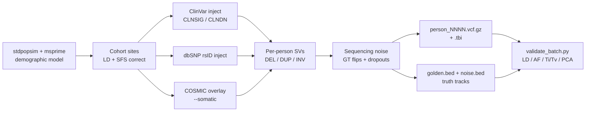

# synthetic-people

**Generate realistic synthetic whole-genome VCFs — at any cohort size, with
truth sets baked in — for pipeline testing, caller benchmarking, teaching,
and any workflow where real human genomes are too sensitive, too slow, or
too small a sample to use directly.**

The headline tool is `synthetic_people/generate_people.py`. It builds an
LD-correct coalescent background under a configurable demographic model,
grounds it against ClinVar / dbSNP / COSMIC at real chromosome
coordinates, layers in structural variants and sequencing noise, and emits
one VCF per person plus a per-person BED4 "golden truth" track that lists
every variant the model put there.

---

## Why synthetic VCFs?

Real human VCFs are slow to obtain (DUAs, IRB, controlled-access
portals), awkward to share (anonymisation, redistribution restrictions),
and fixed in size and composition (you get the cohort the project
collected, not the cohort your test wants). Synthetic VCFs are none of
those things.

| You're trying to… | Real data | synthetic-people |
|---|---|---|
| Run CI on a variant-calling pipeline | Bundle a controlled-access subset | Generate any size cohort on every push |
| Benchmark a caller's per-call accuracy | Hand-curated truth set, expensive | `*.golden.bed` lists every truth call; `*.noise.bed` lists every flip / dropout |
| Test how a tool handles 10 000 samples | Wait for cohort access | `--n 10000` |
| Teach VCF / GATK / scikit-allel | Distribute a public sample subset | Ship a deterministic seed; everyone gets identical files |
| Stress-test a pipeline against admixed data | Specific cohort required | `--admixture --eur-frac 0.6 --sas-frac 0.25 --afr-frac 0.15` |
| Reproduce a colleague's run exactly | Rare in practice | Same `--seed` → byte-identical output |

The output is not real human data. It is *plausible* human data —
matched on the statistical signals callers and downstream tools care
about (LD decay, allele-frequency spectrum, Ti/Tv ≈ 2.1, het/hom
balance), grounded against public variant catalogues for record IDs and
clinical annotations, and correct at the VCF-spec level
(`bcftools view --strict` clean, headers GA4GH-compliant).

---

## Pipeline



Each stage is independently togglable via CLI flags — see the full
flag table in [`synthetic_people/README.md`](synthetic_people/README.md#cli-reference).

---

## Quick start

```bash
sudo apt install bcftools tabix              # htslib binaries
python3 -m venv .venv
.venv/bin/pip install -r synthetic_people/requirements.txt

.venv/bin/python synthetic_people/generate_people.py \
    --n 10 --seed 42 \
    --chromosomes 22 --chr-length-mb 5
```

After the run:

```
out/
├── person_0001.vcf.gz + .tbi          # one per person
├── person_0002.vcf.gz + .tbi
├── ...
├── manifest.json                      # everything cataloged + realised stats
├── truth/
│   ├── person_0001.golden.bed         # every "truth" variant the model placed
│   └── person_0001.noise.bed          # every GT flip / dropout the model injected
└── summary/sfs.tsv                    # cohort allele-count histogram
```

Then validate the batch end-to-end:

```bash
.venv/bin/python synthetic_people/validate_batch.py out/
```

`out/validation/` gains LD-decay, AF-histogram, indel-length, and
cohort-PCA PNGs plus a Markdown report.

---

## What's in the box

| Capability | Flag(s) | Notes |
|---|---|---|
| Coalescent backbone | `--demo-model` `--population` | Default `OutOfAfrica_3G09` / CEU; any stdpopsim HomSap model |
| Three-way admixture | `--admixture --eur-frac --sas-frac --afr-frac` | UK-cohort pulse demography; emits per-person ancestry BED |
| ClinVar pathogenic injection | `--clinvar-inject-density` | Real chromosome coordinates with `CLNSIG` / `CLNDN` |
| dbSNP rsID grounding | `--rsid-density` `--dbsnp-vcf` | Default source = cached ClinVar `INFO/RS`; no extra download |
| COSMIC somatic overlay | `--somatic --cosmic-vcf` | Registration-gated; supply local file |
| Structural variants | `--svs-per-person` `--sv-length-min/max` | DEL / DUP / INV with full SV INFO tag set |
| Sequencing noise | `--error-rate` `--dropout-rate` | Per-call GT flips + coverage dropouts; recomputed GQ reflects flip |
| Per-call quality metrics | always on | DP ~ Poisson(30), AD ~ Binomial(DP, p), GQ Phred-capped |
| Truth-set BEDs | always on | `golden.bed` + `noise.bed` per person, BED4, sort-clean |
| Reproducibility | `--seed` | Same seed + same flags → byte-identical output, regardless of `--workers` |
| Parallel generation | `--workers` | Per-chromosome simulation + per-person VCF write fan-out |
| Cohort validation | `validate_batch.py` | LD decay, allele-freq, Ti/Tv, het/hom, PCA, plot artefacts |

A 5-person × 0.5 Mb chr22 smoke test runs end-to-end (generation +
validation, every artefact verified on disk) in **under 2 minutes** on a
laptop:

```bash
bash synthetic_people/scripts/smoke.sh
```

---

## Documentation

| Document | Audience |
|---|---|
| [`synthetic_people/README.md`](synthetic_people/README.md) | Reference: install, every flag, output layout, milestone history |
| [`synthetic_people/TUTORIAL.md`](synthetic_people/TUTORIAL.md) | Recipe book — guided walkthrough for scientists / academic users |
| [`synthetic_people/SYHTHETIC_PROJECT.md`](synthetic_people/SYHTHETIC_PROJECT.md) | Technical spec the implementation is built against |
| [`synthetic_people/IMPLEMENTATION_PLAN.md`](synthetic_people/IMPLEMENTATION_PLAN.md) | Per-milestone build plan + status |
| [`synthetic_people/PERFORMANCE_PLAN.md`](synthetic_people/PERFORMANCE_PLAN.md) | Phased runtime / memory optimisation tracker |
| [`CLAUDE.md`](CLAUDE.md) | Working notes on the local 1000 Genomes data files |

---

## Repository layout

```
.
├── synthetic_people/             # the generator — most of the code lives here
│   ├── generate_people.py        # CLI entry point
│   ├── validate_batch.py         # cohort validation suite
│   ├── syntheticgen/             # package: coalescent, admixture, overlays, SVs, errors, truth, …
│   ├── tests/                    # ~235 tests; run via python -m unittest discover
│   └── scripts/smoke.sh          # end-to-end smoke test
├── nextflow_pipeline/            # adjacent: a small Nextflow pipeline + qc_validate.py used as a strictness oracle
├── extract_rs12913832.sh         # adjacent: pulls the HERC2 eye-colour SNP from chr15 1000G data
├── download_release_20130502.sh  # adjacent: bulk-fetches the 1000 Genomes Phase 3 release
└── CLAUDE.md                     # working notes on the chr19–22 1000G files kept in this dir
```

The `extract_rs12913832.sh` flow and the chr19–22 1000G files predate
the synthetic-people work; they remain in the tree as worked examples
of real-data extraction and as the reference data the legacy
`--legacy-background` mode draws from. Most contributors will only
touch `synthetic_people/`.

---

## License

GNU General Public License v3 — see [`LICENSE`](LICENSE).
